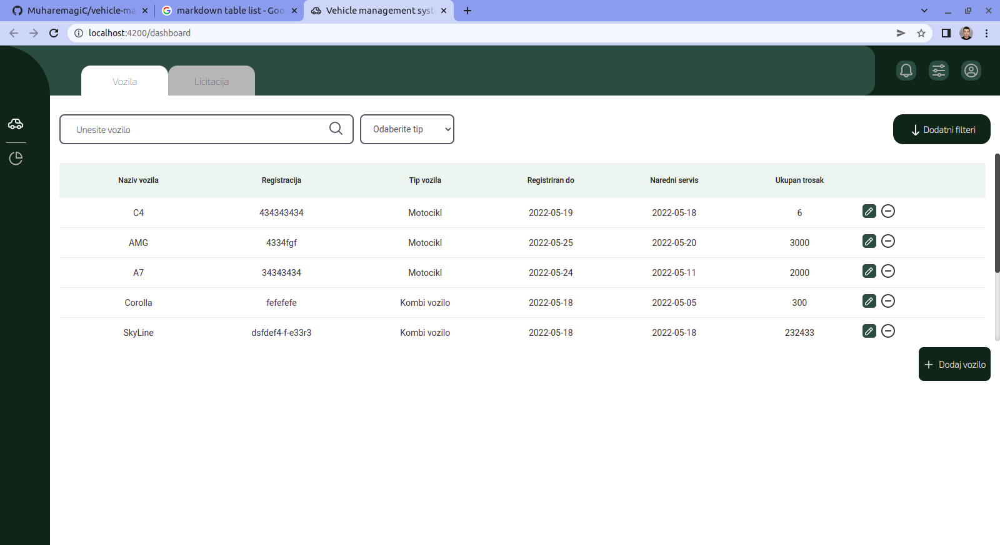

## Table of contents

- [Overview](#overview)
  - [Screenshot](#screenshot)
  - [Links](#links)
- [My process](#my-process)
  - [Built with](#built-with)
  - [What I learned](#what-i-learned)
- [Author](#author)

## Overview

### Screenshot

### Links

- Solution URL: [https://github.com/MuharemagiC/github-user-search-app.git](https://github.com/MuharemagiC/vehicle-management-system)
- Live Site URL: [https://muharemagic.github.io/github-user-search-app/](https://main.d43768fcflm0m.amplifyapp.com/)

## My process

### Built with

- CSS custom properties
- SCSS
- Flexbox
- Mobile-first workflow
- [Angular](https://angular.io/docs) - JS library
- [TypeScript](https://www.typescriptlang.org/) - Programming Language
- [GraphQL](https://graphql.org/learn/)
- [AWS](https://docs.aws.amazon.com/)

### What I learned

This is my first time working with Angular, GraphQL and AWS. This is a simple vehicle management system app. I learned the fundamentals of these technologies. Also I brush by skills in typescript and javascript.

### Continued development

For the future probably I will focus on all of three frontend frameworks and also I will improve my backend skills.

## Author

- Frontend Mentor - [@MuharemagiC](https://www.frontendmentor.io/profile/MuharemagiC)
